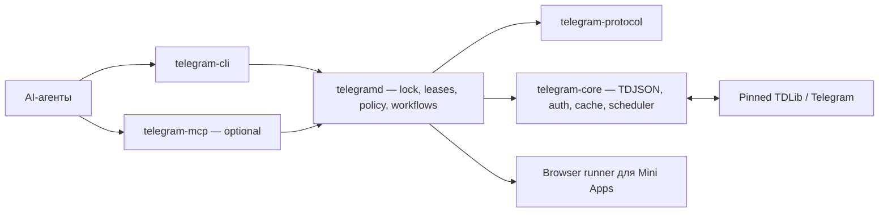

# План работ: Telegram Agent CLI

Статусы, решения, доказательства и deferred scope ведём только в `plans.md`. `product.md`, `HARNESS.md` и feature harness описывают продукт и поведение, но не дублируют последовательность реализации.

## Outcome

Создать Rust-платформу, в которой один daemon владеет авторизованной TDLib-сессией, несколько агентов безопасно используют её через полный CLI, а опциональный MCP предоставляет ту же семантику локально и на сервере. Вся закреплённая TDLib-схема доступна через generated raw API; частые и зависимые операции имеют curated workflows.

## Baseline на 2026-07-15

- Новый workspace изначально не содержал исходников и документации.
- Источник reusable решений: `tg-analytics/crates/telegram-tdlib`, `telegram-agent-gateway`, его policy/auth/rate-limit/fake backend и Web App runner.
- Текущий `tg-analytics` working tree грязный; перенос должен быть выборочным и evidence-backed, без копирования оркестрации аналитического продукта.
- Проверенный upstream snapshot: TDLib `1.8.66`, commit `07d3a0973f5113b0827a04d54a93aaaa9e288348`, 1010 functions.
- Локальная production DB была зашифрована server key; 2026-07-15 key безопасно получен с VPS, digest совпал, права локального файла `0600`.
- Одноразовый TDJSON probe доказал `authorizationStateReady`, успешный `getMe` для regular user и `authorizationStateClosed`; значение ключа и identity в артефакты не записывались.
- Штатный `tg-analytics/scripts/tg-agent.sh` пока не принимает database key; это gap F002, а не потеря Telegram-авторизации.

## Definition of full TDLib support

Пользователь перечислил статистику, channel administration, emoji packs, bot и Mini App testing как remembered use cases. Они задают приоритет, но не ограничивают scope.

Полнота считается доказанной только когда:

1. Закреплены exact TDLib commit, native artifact и hash `td_api.tl`.
2. Все functions, objects, updates и authorization states схемы попали в generated registry.
3. Каждый method имеет ровно одного feature owner, risk, capability, prerequisite и retry/idempotency class.
4. Любой method достижим через общий schema-validated `core.call` и CLI `td call`.
5. MCP, если включён, использует тот же protocol и не создаёт отдельного TDLib owner.
6. Stateful workflows не выдают terminal result до выполнения prerequisite/update/pagination chain.
7. Ограничение аккаунта или прав выражается capability/policy error, а не отсутствием API.

## Целевая архитектура

### Workspace boundaries

- `telegram-protocol`: stable request/response/error/event/freshness envelopes.
- `telegram-core`: TDJSON FFI, authorization, ordered receive loop, update reducer, raw schema registry, workflows, limits, retries, idempotency, audit и metrics.
- `telegramd`: единственный владелец DB/files, OS lock, Unix socket, leases, scheduling и lifecycle.
- `telegram-cli`: обязательный human/JSON/JSONL client без собственной TDLib-сессии.
- `telegram-mcp`: optional adapter к protocol; local stdio и защищённый server transport.
- `telegram-webapp-runner`: browser-side Mini App harness, не часть TDLib core.

## Product decisions

- MVP: один основной regular user account; архитектура допускает отдельные profiles для bot/test accounts, каждый со своей DB.
- На один canonical DB directory допускается один daemon/client owner.
- Local-first: CLI обязателен; MCP начинается только после acceptance core/CLI.
- Default lifecycle: lazy start + lease heartbeat + idle close; resident/scheduled mode разрешён для фонового сбора.
- `close` — штатная остановка; `logOut`/`destroy` — отдельные destructive workflows.
- Секреты поступают из защищённого TTY, file secret или OS keychain и не становятся model-visible arguments.
- Generic raw write не обходит policy; unknown methods default-deny до классификации.
- Full raw coverage и high-level workflow coverage — разные метрики.

## Phase status

| Phase | Результат | Status |
|---|---|---|
| P0 | Контракт, repository skeleton и pinned schema | in_progress — Codex / W-20260715-009 |
| P1 | Core transport, authorization и ordered updates | pending |
| P2 | Singleton daemon и shared session lifecycle | pending |
| P3 | Полный generated raw API | pending |
| P4 | Stateful request-chain engine | pending |
| P5 | Reliability, policy, limits и observability | pending |
| P6 | Полный CLI и компактный agent skill | pending |
| P7 | Domain workflows по F007–F020 | pending |
| P8 | Optional MCP | deferred until P0–P7 accepted |
| P9 | Local/server packaging и upgrade/rollback | pending |
| P10 | Live end-to-end acceptance | pending |

## Documentation bootstrap

- [x] `product.md` фиксирует product boundary и то, что remembered use cases не ограничивают scope.
- [x] `HARNESS.md` адаптирует структуру feature-logic-harness из `tg-analytics` и содержит inventory F001–F022.
- [x] Для каждого feature F001–F022 создан отдельный intended-behavior harness в `docs/feature-logic-harness/`.
- [x] `docs/tdlib-api-coverage.md` фиксирует pinned snapshot и fail-closed контракт полной schema coverage.
- [x] SSH/key/live-access baseline проверен без публикации секрета; реализация безопасного key provider остаётся задачей P1/F002.

Документационный bootstrap завершён; implementation phases P0–P10 остаются незавершёнными.

## P0 — Contract и pinned TDLib snapshot

### Tasks

- [x] Создать Cargo workspace и crate boundaries из раздела Architecture.
- [x] Зафиксировать exact TDLib commit/native build и сохранить `td_api.tl` + SHA-256.
- [ ] Реализовать schema parser, method/type/update/auth-state inventory и feature-owner manifest.
  - [x] Строгий Rust parser и deterministic inventory закреплённой TDLib schema.
  - [ ] Reviewed feature-owner rules/overrides и manifest для всех 1010 methods.
- [ ] Зафиксировать capability matrix: regular user, bot, Business/Premium, admin-gated, official-only.
- [ ] Определить supported targets: macOS arm64 и Linux x86_64 минимум.
- [ ] Перенести только доказанно reusable части `tg-analytics`; не переносить NATS/Postgres/analytics orchestration.

### Acceptance

- [ ] CI обнаруживает любое schema drift.
- [ ] Все parsed methods назначены ровно одному F001–F022 или gate падает.
- [ ] Все constructors, updates и authorization states имеют registry/codec/router/handler parity с pinned schema.
- [ ] Для каждого method заполнены risk/retry/prerequisite/capability поля.
- [ ] Account/session model принят до начала runtime implementation.

### Checkpoints

- `W-20260715-005`: создан workspace из шести целевых packages; optional `telegram-mcp` исключён из `default-members`; skeleton binaries fail closed. Доказательства: `scripts/check-workspace-boundaries.py` с двумя negative controls, `scripts/test-skeleton-process-guard.py`, `scripts/check-skeleton-fails-closed.py`, `cargo test --workspace --all-targets --jobs 2`, `cargo clippy --workspace --all-targets --jobs 2 -- -D warnings`; независимое ревью — approved. Build footprint после gate: 9.1 MiB.
- `W-20260715-006`: exact TDLib schema pin сохранён в `vendor/tdlib` для commit `07d3a097...`; offline gate подтверждает SHA-256, 2168 definitions, 1010 functions, 184 updates и 13 authorization states; independent review — approved. Решение: `D-20260715-003`. Native artifact/build provenance ещё не закреплены, поэтому объединённый task checkbox остаётся open.
- `W-20260715-007`: exact macOS arm64 `tdjson` собран bounded `jobs=2` recipe из pinned source; artifact 27 637 784 bytes, SHA-256 `99e7cdb1...fbb6b49`; committed provenance фиксирует policy/recipe/toolchain/peak resources/Mach-O/dependencies/exports/runtime version+commit и `reproducibility=not_verified`. `provenance-only` и `artifact-verified` gates, 8 tar, 7 process-group, lock, commit и 16 provenance negative controls passed; scratch/process cleanup доказан. Решение: `D-20260715-004`; Linux x86_64 остаётся отдельным open target `P-20260715-003`.
- `W-20260715-008` supersedes current artifact/resource facts из `W-20260715-007` после crash-safety review: offline `jobs=2` rebuild дал 27 654 296 bytes, SHA-256 `5dbd3009...6852e7e`; build 330.225 s, peak sampled RSS 2 064 613 376 bytes, tree 310 298 581 bytes, processes 13. Global lock наследуют все watchdog paths; target gate, recursive stale-state recovery и proof-backed finalization проверены parent/inspection `SIGKILL` controls. Оба checker mode, 17 provenance controls и шесть crash/build suites green; cache `1`, leftovers `0`, `target` 42 MiB. Решение: `D-20260715-005`; Linux `P-20260715-003` и bit-for-bit reproducibility остаются open.
- `W-20260715-009`: в `telegram-core` реализован pure strict-subset parser pinned `td_api.tl` без сторонних dependencies и новых Cargo targets. Он сохраняет raw/structured documentation, строит canonical signatures и sorted inventory, отделяет 9 builtins от 2159 object constructors и подтверждает 1010 methods, 745 type families, 184 updates и 13 authorization states. Input ограничен 2 MiB, type nesting — 32; 12 TDD/negative tests, workspace boundary, Clippy и independent re-review green. Решение: `D-20260715-006`. Feature-owner manifest, generated registry/codec/router parity и runtime остаются незавершёнными, поэтому parent task и P0 acceptance не закрыты.

## P1 — Core transport, authorization и ordered state

### Tasks

- [ ] Реализовать прямой TDJSON transport, один receive loop и `@extra` correlation.
- [ ] Поддержать всю authorization state machine, including QR/phone/code/2FA/email/device/registration branches как schema capabilities.
- [ ] Поддержать database encryption key из file descriptor/file secret/OS keychain; wrong key fail-closed.
- [ ] Реализовать ordered reducer и caches для auth, user, chat, basic/supergroup, file, connection и message send state.
- [ ] Сохранять неизвестные updates как raw, не теряя их.
- [ ] Добавить deadlines, cancellation, startup `getCurrentState` и runtime version handshake.

### Acceptance

- [ ] Параллельные requests не путают responses.
- [ ] Updates воспроизводятся строго в receive order.
- [ ] Restart возвращает Ready без нового login.
- [ ] Wrong/missing key не запускает phone authorization и не повреждает DB.
- [ ] Secrets отсутствуют в logs, metrics и crash output.

## P2 — Singleton daemon и shared session

### Tasks

- [ ] Один `telegramd` и ClientId на profile; exclusive OS lock по canonical DB path.
- [ ] Unix socket `0600`, atomic startup election и stale-socket recovery.
- [ ] Lease ID, principal/scopes, TTL, heartbeat и explicit release.
- [ ] Fair per-account queue; bounded concurrent reads, serialized mutations в MVP.
- [ ] Lifecycle `Stopped -> Starting -> Ready -> Draining -> Closed`.
- [ ] Idle shutdown только при отсутствии leases, in-flight workflows, watchers и jobs.
- [ ] `close` с ожиданием `authorizationStateClosed` до release lock.

### Acceptance

- [ ] Несколько одновременно стартующих агентов сходятся на одном daemon.
- [ ] Второй владелец никогда не открывает ту же DB.
- [ ] Crash клиента освобождает lease по TTL; crash daemon не требует нового login.
- [ ] Acquire во время draining получает детерминированный retry/reattach result.
- [ ] Idle restart сохраняет ту же Telegram authorization.

## P3 — Полный generated raw API

### Tasks

- [ ] Сгенерировать request/type validation и self-describing registry из pinned schema.
- [ ] Реализовать `version`, `capabilities`, `schema search`, `schema describe`, `td call`.
- [ ] Сохранить forward-compatible unknown fields.
- [ ] Применять policy до raw dispatch.
- [ ] Генерировать [coverage report](docs/tdlib-api-coverage.md) из manifest.

### Acceptance

- [ ] `schema_functions == classified_methods == core_raw_methods == cli_raw_methods`.
- [ ] Round-trip tests покрывают все constructors закреплённой схемы.
- [ ] `schema_updates == lossless_routed_updates`, а все authorization states имеют explicit handler.
- [ ] Runtime/schema mismatch обнаруживается до первого рабочего call.
- [ ] Ни один raw method не обходит risk/policy classification.

## P4 — Stateful request-chain engine

### Tasks

- [ ] Разделить `resolve` и `ensure_membership`.
- [ ] Chat list: повторный `loadChats`, ordered position cache, documented terminal condition.
- [ ] Chat workflow: resolve username/link/invite, wait cache, optional `openChat` lease, full info.
- [ ] History/search: pagination по returned cursor до count/date/no-progress boundary; короткая page не терминальна.
- [ ] Members/statistics: проверка capability fields, async graph tokens и freshness rules.
- [ ] File/sticker/bot/Web App workflows с ожиданием terminal updates.
- [ ] Gap marker и обязательный resync после update lag.

### Result envelope

Каждый workflow возвращает `status`, `complete`, `source`, `observed_at`, domain-specific freshness, cursor/next_action, warnings и reconciliation state.

### Acceptance

- [ ] `Chat not found` сначала запускает разрешённый prerequisite resolver.
- [ ] Empty/short response не превращается в terminal proof без method-specific правила.
- [ ] `openChat`/`closeChat` lifecycle выполняется в finally.
- [ ] Send ждёт `updateMessageSendSucceeded` или `Failed`.
- [ ] Mini App workflow возвращает redacted browser handoff, а не заявляет UI success.

## P5 — Reliability, policy, limits и observability

### Tasks

- [ ] Per-account, per-chat и method-class queue/rate budgets без выдуманных глобальных лимитов Telegram.
- [ ] Bounded backoff с jitter и respect server/flood delay.
- [ ] Retry только для safe reads и convergent desired-state operations.
- [ ] Durable idempotency journal: fingerprint + pending/succeeded/failed/uncertain.
- [ ] Reconciliation вместо blind retry для send/create/delete/join/payment unknown outcome.
- [ ] Risk scopes: read, presence, send, reversible mutation, admin, destructive, financial, auth/security.
- [ ] Preview -> plan hash -> external approval/capability для опасных операций.
- [ ] Metrics: latency, queue wait/depth, retry/flood, update lag, cache/freshness, workflow step, leases, close duration.
- [ ] Redacted audit без high-cardinality Telegram identifiers в labels.

### Acceptance

- [ ] Read retry не выполняется раньше разрешённого delay.
- [ ] Write timeout не создаёт дубль.
- [ ] Queue overflow/cancellation дают стабильный error envelope.
- [ ] Agent не может сам сфабриковать human approval.
- [ ] Secret scanning и telemetry tests не находят sensitive values.

## P6 — CLI и компактный agent skill

### Tasks

- [ ] CLI commands: session/status/login/hold/release, schema, call, workflow, events/watch.
- [ ] Human output и стабильный compact JSON/JSONL; versioned error/exit-code contract.
- [ ] Streaming, cancellation и signal-safe lease release.
- [ ] Secure TTY для OTP/2FA; secrets никогда не являются обычными flags.
- [ ] Agent skill не перечисляет API: acquire -> discover -> workflow/call -> follow next_action -> release.
- [ ] Context budget skill не более 1500 tokens; detailed schema загружается on demand.

### Acceptance

- [ ] Каждый core raw method и workflow доступен из CLI.
- [ ] Агент не парсит prose для machine decisions.
- [ ] Cold-agent eval проходит history, statistics, sticker, bot и Mini App handoff scenarios.
- [ ] Skill не создаёт новый login/daemon и не повторяет uncertain mutation.

## P7 — Domain workflows F007–F020

Реализовывать вертикальными slices с feature harness как intended-behavior source:

- [ ] F007 users/contacts/profile.
- [ ] F008 chats/folders/topics/secret chats.
- [ ] F009 messages/history/search/interactions.
- [ ] F010 files/media.
- [ ] F011 groups/channels/moderation/forums/boosts.
- [ ] F012 bots/testing.
- [ ] F013 Mini Apps.
- [ ] F014 stickers/custom emoji.
- [ ] F015 stories/calls/live.
- [ ] F016 account settings/privacy/notifications/sessions.
- [ ] F017 Business.
- [ ] F018 payments/digital assets/Passport.
- [ ] F019 statistics/resources.
- [ ] F020 platform utilities/custom/test API.
- [ ] F021 reliability/policy/limits/metrics/audit как сквозной feature contract.
- [ ] F022 compact agent skill/self-discovery.

Для каждого slice обязательны schema mapping, capability/risk rules, success/error/cancellation/recovery tests и live proof только там, где права аккаунта это позволяют.

## P8 — Optional MCP

Decision gate: начинать только после acceptance P0–P7.

### Tasks

- [ ] MCP — adapter к daemon/protocol, не TDLib owner.
- [ ] Небольшой набор tools: session status, `auth.begin/status/wait`, capabilities/schema, workflow, call, events.
- [ ] Local stdio и аутентифицированный remote transport.
- [ ] Brokered login возвращает challenge ID/next action; владелец вводит OTP/2FA/database key через защищённый local TTY или SSH operator channel, а не model-visible MCP arguments.
- [ ] Общая generated parity matrix CLI/MCP.

### Acceptance

- [ ] Запуск MCP не создаёт новую Telegram session.
- [ ] Fresh-profile login, инициированный через MCP, использует тот же daemon/auth state machine, достигает Ready/getMe и не помещает secret в MCP transcript.
- [ ] Отключение MCP не уменьшает core/CLI functionality.
- [ ] Remote endpoint требует identity, scoped authorization и encryption.
- [ ] MCP context не содержит каталог из 1000 tools.

## P9 — Packaging, server и upgrades

### Tasks

- [ ] Reproducible pinned TDLib builds для macOS arm64 и Linux x86_64.
- [ ] launchd/systemd socket activation, persistent DB, keychain/file-secret integration.
- [ ] Local paths vs remote upload/download semantics.
- [ ] Backup только после Closed; restore, schema upgrade, rollback на копии DB.
- [ ] Server deployment без публичного unauthenticated port; SSH/TLS transport.
- [ ] One account/profile per isolated DB and secret scope.

### Acceptance

- [ ] Clean install, host restart и upgrade сохраняют authorization.
- [ ] Rollback проверен без открытия одной DB двумя версиями одновременно.
- [ ] File/key permissions fail closed.
- [ ] Удаление клиента не удаляет account session без явного logout workflow.

## P10 — Live end-to-end gate

### Scenarios

- [ ] First login и returning encrypted login.
- [ ] Два параллельных агента и crash одного lease holder.
- [ ] List/resolve/open/history/search/full info/members/statistics.
- [ ] Channel configuration и moderation с preview/verify.
- [ ] Sticker/custom emoji create/update/delete на disposable наборе.
- [ ] Bot start/send/reply/callback и terminal send states.
- [ ] Mini App launch + browser bridge/DOM/network/screenshot handoff.
- [ ] Network loss, flood wait, update lag, cancellation, daemon crash.
- [ ] Idle stop/start с Closed/Ready proof.
- [ ] Audit active Telegram sessions до/после и отсутствие нового login-дубля.

### Final gate

- [ ] Requirement-by-requirement evidence приложено к plan checkpoints.
- [ ] Generated coverage доказывает полный pinned API.
- [ ] Deferred/rights-limited/official-only cases перечислены честно.
- [ ] Тестовые сообщения, packs, files и browser artifacts очищены.
- [ ] Secrets отсутствуют в Git, output и artifacts.

## Risks and mitigations

| Risk | Mitigation |
|---|---|
| Schema/native drift | Exact commit/hash, startup handshake, CI inventory diff |
| DB corruption или двойной owner | OS lock, one daemon, close-before-backup |
| False `not_found` | Update cache, prerequisite graph, completeness envelope |
| Duplicate mutation | Idempotency journal, terminal updates, reconciliation |
| Agent self-approval | External plan capability, scoped leases, audit |
| Secret exposure | File descriptor/keychain/TTY, redaction and secret scanning |
| MCP expands attack surface | Deferred adapter, auth/TLS/scopes, no direct DB |
| Mini App false confidence | Explicit browser handoff and separate UI assertions |

## Open decisions with defaults

- Multiple accounts: architecture supports; MVP ships one primary regular profile.
- Resident analytics: configurable, default `on-demand` with idle timeout.
- MCP: deferred; local agents use CLI.
- Remote login: secure operator channel/SSH, never ordinary MCP arguments.
- Official-only methods: present and classified; expected runtime denial is a supported result.
- Generated typed bindings: raw registry required; typed wrappers added only for workflows where they improve correctness.

## Living-plan rules

- При начале phase перевести её status в `in_progress` и указать owner/checkpoint.
- Checkbox закрывать только со свежей командой или artifact evidence.
- Любой обнаруженный TDLib method без owner сначала блокирует coverage gate, затем добавляется в существующую фичу либо новым решением в `HARNESS.md`.
- Не переписывать baseline как implementation claim.
- После финальной проверки перечитать status и удалить устаревшие blocker statements.

## References

- [Product context](product.md)
- [Harness profile](HARNESS.md)
- [TDLib API coverage contract](docs/tdlib-api-coverage.md)
- [Feature harness directory](docs/feature-logic-harness/)
- [Official TDLib repository](https://github.com/tdlib/td)
- [Official TDLib getting started](https://core.telegram.org/tdlib/getting-started)
