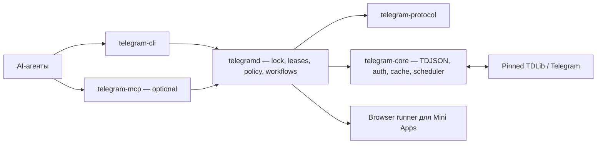

# План работ: Telegram Agent CLI

Статусы, решения и deferred scope ведём только в `plans.md`. `product.md`, `HARNESS.md` и feature harness описывают продукт и поведение, но не дублируют последовательность реализации. История выполнения — в git и `.memory/`, а не в этом файле.

## Outcome

Создать Rust-платформу, в которой один daemon владеет авторизованной TDLib-сессией, несколько агентов безопасно используют её через полный CLI, а опциональный MCP предоставляет ту же семантику локально и на сервере. Вся закреплённая TDLib-схема доступна через generated raw API; частые и зависимые операции имеют curated workflows.

## Baseline на 2026-07-15

Сделано и проверено:

- Документационный bootstrap: `product.md`, `HARNESS.md` c inventory F001–F022, harness-файлы, `docs/tdlib-api-coverage.md`.
- Cargo workspace из шести пакетов; границы защищены `scripts/check-workspace-boundaries.py`.
- Pinned schema: TDLib `1.8.66`, commit `07d3a0973f5113b0827a04d54a93aaaa9e288348`, 1010 functions; gate `scripts/check-tdlib-pin.py`.
- Strict schema parser и deterministic inventory в `crates/telegram-core/src/schema.rs`.
- macOS arm64 и Linux x86_64 `tdjson` artifacts с provenance; gate `scripts/check-tdlib-native-pin.py`.
- Прямой TDJSON transport и bounded core runtime: один receive loop, transport-owned `@extra`, deadlines/cancellation, runtime identity handshake и startup `getCurrentState`.
- `telegramd` принимает profile config, удерживает exclusive canonical DB owner lock и поднимает private `0600` Unix socket с stale recovery.
- Private socket обслуживает bounded JSONL leases: boot-unique ID, principal/opaque scopes, TTL, heartbeat и explicit release.
- Per-profile `AccountScheduler` применяет FIFO fairness: bounded read prefix и ровно одна active mutation.
- Ручное capability-ревью 74 методов сохранено в `docs/capability-notes.md`; documentation-recognizer engine удалён как переусложнение (см. git history).
- Существующая зашифрованная TDLib-сессия свежим live-gate достигла Ready, прошла `getMe` и штатно закрылась без нового login input; database key поступил через protected loader.
- Источник reusable решений: `tg-analytics/crates/telegram-tdlib` и `telegram-agent-gateway`; evidence-backed disposition закреплён в `docs/tg-analytics-reuse.md`, без копирования analytics-оркестрации.

Не сделано: runtime P2–P10. Product binaries — fail-closed заглушки.

## Правила работы

Обязательные ограничения для любого агента, работающего по этому плану. Они существуют, потому что проект уже один раз ушёл в переусложнение (per-method модули, drift-тесты на pinned-схему, hash-pinned счётчики) и потерял день работы.

1. **Размер задачи.** Единица работы — пункт списка Tasks фазы, не один TDLib-метод и не один файл. Если пункт не закрывается за разумную сессию — разбей его на 2–4 подпункта в plans.md, но не глубже.
2. **Схема закреплена одним хешем.** `scripts/check-tdlib-pin.py` — единственная защита от drift. Запрещены тесты, мутирующие текст схемы («а что если описание изменится»), и любые per-method signature/documentation hash evidence.
3. **Никаких self-referential тестов.** Тест, который хранит хеш или счётчик набора и требует правки при каждом добавлении данных, запрещён. Тесты проверяют поведение, не слепок данных.
4. **Классификация — данные, не код.** Свойства методов (risk, capability, retry) живут в одной таблице данных. Запрещено заводить Rust-модуль на семейство методов или парсить документацию схемы как источник контрактов.
5. **Default-deny — валидное состояние.** Неотревьюенный метод просто запрещён политикой. Ревью добирается пачками по мере надобности и не блокирует ни одну фазу.
6. **Тесты пропорциональны коду.** Если diff содержит больше строк тестов, чем кода, и это не bugfix — остановись и пересмотри подход. Негативные контролы нужны только у trust boundaries (secrets, DB ownership, policy gate).
7. **Память без ритуала.** Одна wiki-entry на завершённый пункт Tasks. `D-` — только долговечные архитектурные решения (не «решение» про один метод). Raw digest — только для внешних доказательств (сборка, сеть, live-сессия), не для пересказа кода.
8. **Не углублять фазу сверх acceptance.** Когда критерии фазы выполнены — фаза закрыта, переходи дальше. Улучшения сверх acceptance — отдельный пункт в backlog фазы-владельца.
9. **Никаких спекулятивных механизмов.** Format versions, byte caps, resource limits и конфиги появляются только вместе с потребителем, которому они нужны сегодня.

## Definition of full TDLib support

Именованные пользователем сценарии (статистика, администрирование каналов, emoji packs, тестирование ботов и Mini Apps) — приоритетные примеры, не граница scope. Полнота доказана, когда:

1. Закреплены exact TDLib commit, native artifact и hash `td_api.tl`.
2. Все functions, objects, updates и authorization states схемы попали в generated registry.
3. Каждый method имеет risk, capability, prerequisite и retry/idempotency class (default-deny допустим).
4. Любой method достижим через общий schema-validated `core.call` и CLI `td call`.
5. MCP, если включён, использует тот же protocol и не создаёт отдельного TDLib owner.
6. Stateful workflows не выдают terminal result до выполнения prerequisite/update/pagination chain.
7. Ограничение аккаунта или прав выражается capability/policy error, а не отсутствием API.

## Целевая архитектура

## Зоны ответственности

| Компонент | Владеет | Не делает |
|---|---|---|
| `crates/telegram-protocol` | Stable request/response/error/event/freshness envelopes | Бизнес-логика, TDLib-типы, IO |
| `crates/telegram-core` | TDJSON FFI, authorization, ordered receive loop, update reducer, schema parser, generated registry, workflows, retries, idempotency | Владение DB/process lifecycle, транспорт до клиентов |
| `apps/telegramd` | Единственный владелец TDLib DB: OS lock, Unix socket, leases, scheduling, policy enforcement, lifecycle | Прямые TDLib-вызовы в обход core, парсинг схемы |
| `apps/telegram-cli` | Human/JSON/JSONL client поверх protocol | Собственная TDLib-сессия, собственная workflow-логика |
| `apps/telegram-mcp` | Optional adapter protocol→MCP | Отдельная бизнес-логика, второй TDLib owner |
| `apps/telegram-webapp-runner` | Browser-side Mini App harness | Что-либо TDLib-side |
| `tools/tdlib-registry-gen` | Offline-генерация registry из pinned schema + capability-таблицы | Runtime-код, сеть, TDLib DB |
| `scripts/` | Fail-closed gates: schema pin, native pin, workspace/planning boundaries, wiki rotation | Дублирование проверок, которые уже делает cargo |

Правило: product-пакеты не зависят от tools; только daemon открывает DB; CLI/MCP не содержат TDLib.

## Product decisions

- MVP: один основной regular user account; архитектура допускает отдельные profiles, каждый со своей DB.
- На один canonical DB directory — один daemon/client owner.
- Local-first: CLI обязателен; MCP начинается только после acceptance core/CLI.
- Default lifecycle: lazy start + lease heartbeat + idle close; resident/scheduled mode разрешён для фонового сбора.
- `close` — штатная остановка; `logOut`/`destroy` — отдельные destructive workflows.
- Секреты поступают из защищённого TTY, file secret или OS keychain и не становятся model-visible arguments.
- Generic raw write не обходит policy; unknown methods default-deny до классификации.
- Full raw coverage и high-level workflow coverage — разные метрики.

## Phase status

| Phase | Результат | Status |
|---|---|---|
| P0 | Контракт, repository skeleton и pinned schema | accepted |
| P1 | Core transport, authorization и ordered updates | accepted |
| P2 | Singleton daemon и shared session lifecycle | accepted |
| P3 | Полный generated raw API и capability-таблица | accepted |
| P4 | Stateful request-chain engine | accepted |
| P5 | Reliability, policy, limits и observability | accepted |
| P6 | Полный CLI и компактный agent skill | complete |
| P7 | Domain workflows по F007–F020 | accepted |
| P8 | Optional MCP | pending |
| P9 | Local/server packaging и upgrade/rollback | pending |
| P10 | Live end-to-end acceptance | pending |

## P0 — Contract и pinned TDLib snapshot

### Tasks

- [x] Cargo workspace и crate boundaries из раздела «Зоны ответственности».
- [x] Exact TDLib commit/native build; `td_api.tl` + SHA-256 под gate.
- [x] Schema parser и deterministic inventory.
- [x] Ручное capability-ревью первых семейств; результаты в `docs/capability-notes.md`. Продолжение ревью — по потребности в P3+, пачками, без выделенных задач.
- [x] Определить supported targets: закрепить Linux x86_64 native artifact (macOS arm64 уже есть).
- [x] Перенести только доказанно reusable части `tg-analytics`; не переносить NATS/Postgres/analytics orchestration.

### Acceptance

- [x] CI обнаруживает любое schema/native drift — зачем: всё остальное (registry, policy, codec) строится на неизменности snapshot; один сломанный hash-gate дешевле тысяч defensive-тестов.
- [x] Оба target (macOS arm64, Linux x86_64) имеют pinned artifact с provenance — зачем: сервер деплоится на Linux; без этого P9 не начать.
- [x] Planning IDs (F001–F022) отсутствуют в executable code — зачем: номера документации не должны становиться runtime-таксономией; это уже приводило к удалению 20k строк.
- [x] Account/session model принят до начала runtime — зачем: смена модели после P2 означает переписывание daemon.

## P1 — Core transport, authorization и ordered state

### Tasks

- [x] Прямой TDJSON transport, один receive loop и `@extra` correlation.
- [x] Полная authorization state machine: QR/phone/code/2FA/email/device/registration branches.
- [x] Database encryption key из file descriptor/file secret/OS keychain; wrong key fail-closed.
- [x] Ordered reducer и caches для auth, user, chat, basic/supergroup, file, connection и message send state.
- [x] Неизвестные updates сохраняются raw, без потери.
- [x] Deadlines, cancellation, startup `getCurrentState`, runtime version handshake.

### Acceptance

- [x] Параллельные requests не путают responses — зачем: это фундамент корректности всего API; ошибка здесь ломает каждый вызов выше.
- [x] Updates воспроизводятся строго в receive order — зачем: state-machine TDLib предполагает ordering; нарушение даёт тихо неверный cache.
- [x] Restart возвращает Ready без нового login — зачем: повторные login-flows ведут к rate-limits и риску блокировки аккаунта.
- [x] Wrong/missing key не запускает phone authorization и не повреждает DB — зачем: авто-fallback на новый login уничтожил бы существующую сессию.
- [x] Secrets отсутствуют в logs, metrics и crash output — зачем: невыполнение — прямая утечка доступа к аккаунту; проверяется secret-scanning тестом.

## P2 — Singleton daemon и shared session

### Tasks

- [x] Один `telegramd` на profile; exclusive OS lock по canonical DB path.
- [x] Unix socket `0600`, atomic startup election, stale-socket recovery.
- [x] Lease: ID, principal/scopes, TTL, heartbeat, explicit release.
- [x] Fair per-account queue; bounded concurrent reads, serialized mutations в MVP.
- [x] Lifecycle `Stopped -> Starting -> Ready -> Draining -> Closed`; idle shutdown только без активных leases/workflows; `close` с ожиданием `authorizationStateClosed`.

### Acceptance

- [x] Несколько одновременно стартующих агентов сходятся на одном daemon — зачем: гонка стартов — главный сценарий реальной эксплуатации несколькими агентами.
- [x] Второй владелец никогда не открывает ту же DB — зачем: двойное владение необратимо повреждает TDLib DB.
- [x] Crash клиента освобождает lease по TTL; crash daemon не требует нового login — зачем: без этого любой сбой блокирует всех или жжёт авторизацию.
- [x] Idle restart сохраняет ту же Telegram authorization — зачем: подтверждает, что lifecycle не деградирует сессию.

## P3 — Полный generated raw API и capability-таблица

### Tasks

- [x] Generated registry из pinned schema: request/type validation, self-describing descriptors, forward-compatible unknown fields.
- [x] Capability-таблица (данные): risk class, account scope, runtime requirements, retry/idempotency. Стартовое наполнение — `docs/capability-notes.md`; всё остальное default-deny.
- [x] `version`, `capabilities`, `schema search`, `schema describe`, `td call` в core.
- [x] Policy применяется до raw dispatch.
- [x] Coverage report генерируется из manifest в `docs/tdlib-api-coverage.md`.

### Acceptance

- [x] `schema_functions == registry_methods == core_raw_methods` — зачем: числовое равенство — единственное честное доказательство «полного API», иначе coverage — мнение.
- [x] Round-trip tests покрывают все constructors; updates маршрутизируются losslessly — зачем: потеря неизвестного поля незаметна сегодня и фатальна при следующем upstream bump.
- [x] Runtime/schema mismatch обнаруживается до первого рабочего call — зачем: расхождение runtime и registry даёт недиагностируемые ошибки сериализации.
- [x] Ни один raw method не обходит policy; неклассифицированный метод — deny — зачем: raw API даёт доступ к destructive/financial операциям.

## P4 — Stateful request-chain engine

### Tasks

- [x] Разделить `resolve` и `ensure_membership`.
- [x] Chat list: повторный `loadChats`, ordered position cache, documented terminal condition.
- [x] Chat workflow: resolve username/link/invite, wait cache, optional `openChat` lease, full info.
- [x] History/search: pagination по returned cursor до count/date/no-progress boundary.
- [x] Members/statistics: capability fields, async graph tokens, freshness rules.
- [x] File/sticker/bot/Web App workflows с ожиданием terminal updates.
- [x] Gap marker и обязательный resync после update lag.

Каждый workflow возвращает envelope: `status`, `complete`, `source`, `observed_at`, freshness, cursor/next_action, warnings, reconciliation state.

### Acceptance

- [x] `Chat not found` сначала запускает разрешённый prerequisite resolver — зачем: это pain №1 из product.md; агент не должен получать false not_found.
- [x] Empty/short response не превращается в terminal proof без method-specific правила — зачем: короткая страница пагинации — норма TDLib, а не конец данных.
- [x] `openChat`/`closeChat` lifecycle выполняется в finally — зачем: незакрытые чаты копят server-side подписки и искажают updates.
- [x] Send ждёт `updateMessageSendSucceeded`/`Failed` — зачем: ответ на sendMessage — не доказательство доставки; без ожидания невозможен честный idempotency.

## P5 — Reliability, policy, limits и observability

### Tasks

- [x] Per-account, per-chat и method-class queue/rate budgets; bounded backoff с jitter, respect flood delay.
- [x] Retry только для safe reads и convergent desired-state operations.
- [x] Durable idempotency journal: fingerprint + pending/succeeded/failed/uncertain; reconciliation вместо blind retry.
- [x] Risk scopes: read, presence, send, reversible mutation, admin, destructive, financial, auth/security.
- [x] Preview -> plan hash -> external approval для опасных операций.
- [x] Metrics (latency, queue, retry/flood, update lag, freshness, leases) и redacted audit.

### Acceptance

- [x] Write timeout не создаёт дубль — зачем: дубль-сообщение или двойное удаление — видимый пользователю ущерб; ядро promise продукта.
- [x] Read retry не выполняется раньше разрешённого delay — зачем: игнорирование flood wait ведёт к эскалации банов от Telegram.
- [x] Agent не может сам сфабриковать human approval — зачем: policy gate бессмыслен, если вызывающая сторона может его пройти сама.
- [x] Secret scanning и telemetry tests не находят sensitive values — зачем: metrics/audit — самый частый канал непреднамеренной утечки.

## P6 — CLI и компактный agent skill

### Tasks

- [x] CLI session commands: status, hold и release поверх daemon protocol.
- [x] CLI schema search/describe и universal `td call` поверх того же daemon protocol.
- [x] CLI routes для всех реализованных core workflows.
- [x] CLI login и events/watch routes поверх authorization/update broker.
- [x] Human output и стабильный compact JSON/JSONL; versioned error/exit-code contract.
- [x] Streaming, cancellation, signal-safe lease release.
- [x] Secure TTY для OTP/2FA; secrets никогда не flags.
- [x] Agent skill: acquire -> discover -> workflow/call -> follow next_action -> release; ≤1500 tokens, без каталога API.

### Acceptance

- [x] Каждый core raw method и workflow доступен из CLI — зачем: CLI — обязательная поверхность; дыра в parity делает «полный API» ложью.
- [x] Агент не парсит prose для machine decisions — зачем: prose-parsing ломается при каждой правке текста; JSON contract — нет.
- [x] Cold-agent eval проходит history, statistics, sticker, bot и Mini App handoff scenarios — зачем: skill проверяется на агенте без контекста проекта, как в реальности.

## P7 — Domain workflows F007–F020

Вертикальные slices, feature harness — intended-behavior source. Для каждого slice: schema mapping, capability/risk rules, success/error/cancellation/recovery tests, live proof только там, где права аккаунта позволяют.

- [x] F007 users/contacts/profile.
- [x] F008 chats/folders/topics.
- [x] F009 messages/search.
- [x] F010 files/media.
- [x] F011 groups/channels/moderation.
- [x] F012 bots/testing.
- [x] F013 Mini Apps.
- [x] F014 stickers/custom emoji.
- [x] F015 stories/calls/live.
- [x] F016 account settings.
- [x] F017 Business.
- [x] F018 payments/digital assets.
- [x] F019 statistics/resources.
- [x] F020 platform utilities.
- [x] F021 reliability как сквозной contract.
- [x] F022 agent skill.

Acceptance: критерии соответствующего harness-файла выполнены и подтверждены тестами — зачем: harness уже описывает intended behavior; дублировать его в плане — расхождение двух источников.

## P8 — Optional MCP

Decision gate: начинать только после acceptance P0–P7.

### Tasks

- [ ] MCP — adapter к daemon/protocol; небольшой набор tools (session, auth.begin/status/wait, schema, workflow, call, events).
- [ ] Local stdio и аутентифицированный remote transport.
- [ ] Brokered login: challenge ID/next action; secret вводится вне model-visible transport.

### Acceptance

- [ ] Запуск MCP не создаёт новую Telegram session; отключение MCP не уменьшает core/CLI — зачем: MCP — adapter, а не второй продукт; это главный анти-drift критерий.
- [ ] Remote endpoint требует identity, scoped authorization и encryption — зачем: неаутентифицированный endpoint — это чужой полный доступ к аккаунту.
- [ ] MCP context не содержит каталог из 1000 tools — зачем: контекст агента — ограниченный ресурс; discovery должен быть on-demand.

## P9 — Packaging, server и upgrades

### Tasks

- [ ] Reproducible pinned TDLib builds для обоих targets.
- [ ] launchd/systemd socket activation, persistent DB, keychain/file-secret integration.
- [ ] Backup только после Closed; restore, schema upgrade, rollback на копии DB.
- [ ] Server deployment без публичного unauthenticated port.

### Acceptance

- [ ] Clean install, host restart и upgrade сохраняют authorization — зачем: потеря сессии при апгрейде делает продукт неэксплуатируемым.
- [ ] Rollback проверен без открытия одной DB двумя версиями — зачем: даунгрейд поверх новой DB-схемы — классический сценарий corruption.
- [ ] File/key permissions fail closed — зачем: DB и ключи — это аккаунт целиком.

## P10 — Live end-to-end gate

### Scenarios

- [ ] First login и returning encrypted login; два параллельных агента; crash одного lease holder.
- [ ] List/resolve/open/history/search/full info/members/statistics.
- [ ] Channel configuration и moderation с preview/verify.
- [ ] Sticker/emoji lifecycle на disposable наборе; bot start/send/reply/callback; Mini App launch + browser handoff.
- [ ] Network loss, flood wait, update lag, cancellation, daemon crash; idle stop/start.

### Final gate

- [ ] Requirement-by-requirement evidence приложено к фазам — зачем: «работает у меня» не является приёмкой; нужен воспроизводимый след.
- [ ] Generated coverage доказывает полный pinned API; deferred/rights-limited cases перечислены честно — зачем: продукт обещает полноту с честной разметкой, а не идеальность.
- [ ] Тестовые артефакты очищены; secrets отсутствуют в Git/output — зачем: e2e-прогон не должен оставлять мусор в реальном аккаунте и утечки в репозитории.

## Risks and mitigations

| Risk | Mitigation |
|---|---|
| Schema/native drift | Exact commit/hash, startup handshake, CI pin gates |
| DB corruption или двойной owner | OS lock, один daemon, close-before-backup |
| False `not_found` | Update cache, prerequisite graph, completeness envelope |
| Duplicate mutation | Idempotency journal, terminal updates, reconciliation |
| Agent self-approval | External plan capability, scoped leases, audit |
| Secret exposure | FD/keychain/TTY, redaction, secret scanning |
| Возврат к переусложнению | Раздел «Правила работы» обязателен; ревью diff на пропорцию тестов и self-referential проверки |
| Mini App false confidence | Explicit browser handoff, отдельные UI assertions |
